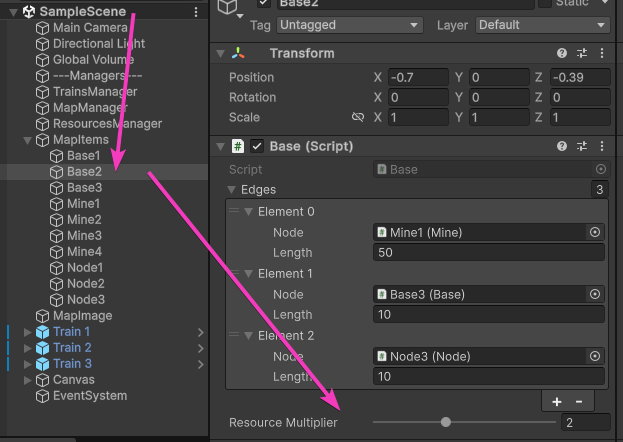
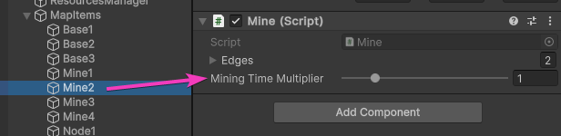
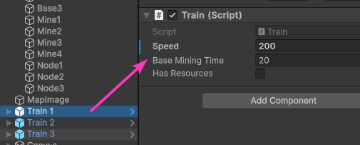
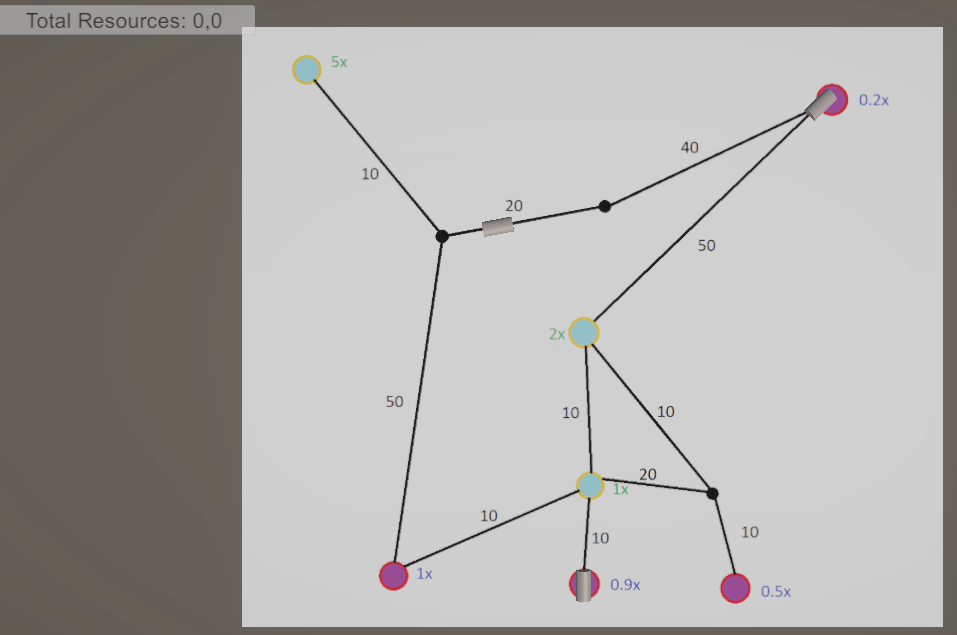

### Компоненты:

**Node** - узел графа, содержащий соседей  
**Base**, **Mine** - разновидности узлов (база и шахта), содержат характерные параметры  
**Train** - бегает по указанному пути  

### Сервисы:

**TrainsService** - следит за поездами, назначает пути в зависимости от состояния поезда  
**GraphService** - обычное нахождение пути по узлам, оценка стоимости расстояния между узлов  
**EfficiencyPathService** - сервис инкапсулирующий логику нахождения наилучшего пути до указанного типа узла  
**BaseEfficiencyPathSolver, MineEfficiencyPathSolver** - реализации нахождения наилучшего пути для соответствующих узлов, позволяет легко расширять данный функционал  
**ResourcesService** - ведет учет ресурсов  

### Настройки баз:  
  

### Настройки шахт:  
  

### Настройки поездов:  
  

---

